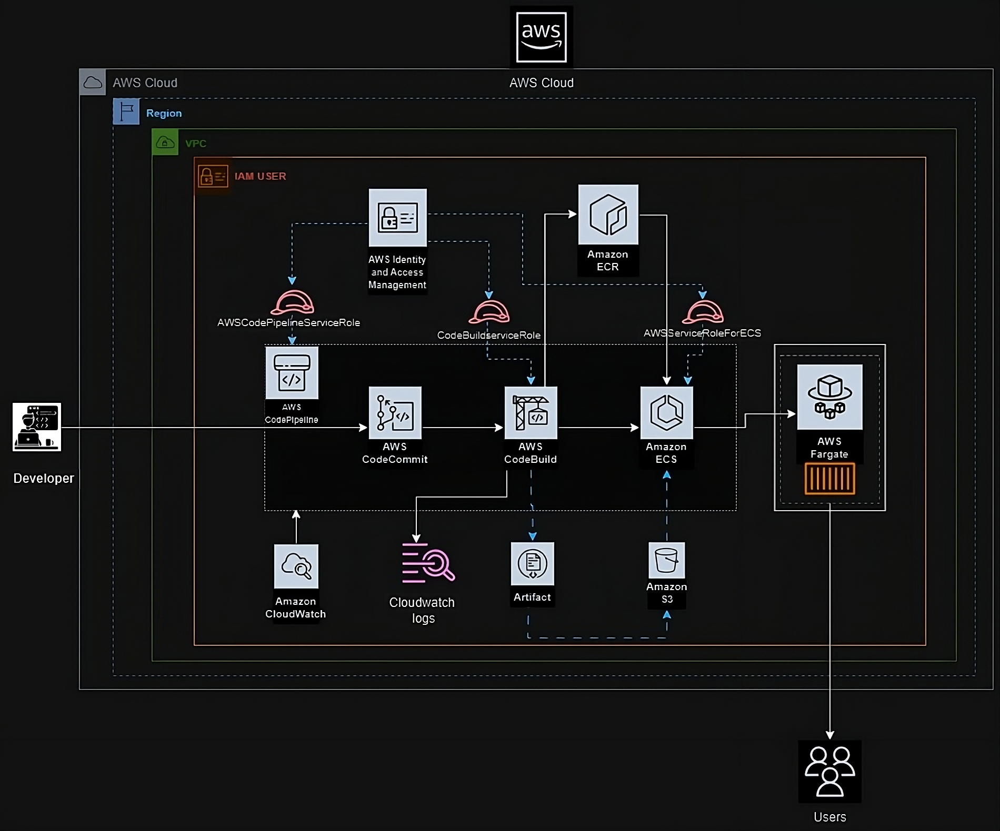

# Project Description: Streamlined CI/CD Deployment with AWS DevOps Services and ECS Fargate

### AWS-Docker-CI/CD-Project
This AWS DevOps project shows how to use a fully automated CI/CD pipeline to deploy Docker images in a systematic manner. To guarantee smooth and effective application deployment, the project makes use of a number of AWS services, such as CodePipeline, CodeCommit, CodeBuild and ECS Fargate.

#### Project Architecture

#### Highlights 

- **🚀 Amazon Configuration:** Using AWS services like ECS and ECR, the architecture is built with scalability and stability in mind.
- **💻 CodeCommit:** For organizing source code, a repository is set up that provides Git-like capabilities and strong version control. 
- **🛠️ CodeBuild:** To expedite the build process, Docker images are created and pushed to ECR. 
- **📦 Deploy Process:** By deploying images from ECR to ECS Fargate using CodePipeline, container management is made possible without the need to manage servers. 
- **🔄 Automated Pipeline:** CodePipeline automates the release process by utilizing continuous deployment. 
- **🔍 Manual Approval:** To guarantee regulated deployments, manual approval procedures are put in place inside the pipeline. 
- **Mistake Management:** Resolving deployment problems, such inadequate CPU usage, is necessary to keep deployment stability. 

#### Important Takeaways 

- **🌞 Serverless:** The orchestration configuration is streamlined and standardized by using the serverless ECS Fargate service for container management.
- **Security Version:** In order to manage code and track changes, CodeCommit keeps version histories and improves teamwork. 
- **CI/CD Advantages:** CodePipeline accelerates deployment cycles and reduces manual errors in software releases, promoting an agile development environment. 
- **🐳 Docker Efficiency:** Docker containerization ensures consistency across many environments and makes application deployment and scaling on AWS easier. 
- **🔒 Security Best Practices:** Ensuring that only authorized operations are carried out while granting essential access to services requires the proper IAM roles and permissions. 
- **❌ Error Handling:**  Constant integration and monitoring with CloudWatch contribute to early detection of deployment problems and uphold application reliability. 

#### Tools and Technologies Used
- **AWS CodePipeline:** Automates the deployment process by connecting many AWS services and orchestrating the complete CI/CD workflow.
- **AWS CodeCommit:** Offers version control and collaborative tools in addition to acting as the source code repository.
- **AWS CodeBuild:** Docker images are created and sent to ECR automatically as part of the build process. 
- **AWS ECS:** Ensures effective container orchestration by managing the deployment of Docker images from ECR to ECS Fargate. 
- **Fargate:** Offers serverless container management, enabling the deployment and scaling of applications without requiring management of the underlying infrastructure. 
- **Docker:** Containerization makes the application uniform and portable between various deployment environments. 
- **IAM Roles and Permissions:** Maintain least privilege security while providing safe access control to AWS resources. 
- **AWS CloudWatch:** Keeps an eye on installations, offering insights and early problem detection to preserve system health. 

#### Workflow for CI/CD Pipelines 

1. **Code Commit:** Code modifications are uploaded to the CodeCommit repository by developers.
2. **Build:** Docker images are created from committed code by CodeBuild, which is triggered by CodePipeline. 
3. **Store:** Docker images that have been built are pushed to ECR. 
4. **Deploy:** CodeBuild and CodePipeline builds and moves the Docker images to ECS Fargate after retrieving them from ECR. 
5. **Approval:** To guarantee that deployments are examined before becoming live, manual approval procedures are incorporated. 
6. **Monitor:** CloudWatch is used to keep an eye on deployments for any problems or performance indicators. 

Through the use of Docker and ECS Fargate in an automated continuous integration and deployment pipeline, the project showcases a reliable and expandable approach to continuous deployment, capitalizing on the advantages of AWS services to improve productivity, security, and cooperation. 

#### Project resources:

- CI/CD on AWS: https://docs.aws.amazon.com/whitepapers/latest/cicd_for_5g_networks_on_aws/cicd-on-aws.html
- Setting up for AWS CodeCommit: https://docs.aws.amazon.com/codecommit/latest/userguide/setting-up.html
- Getting started with AWS CodeBuild: https://docs.aws.amazon.com/codebuild/latest/userguide/getting-started.html
- Getting started with CodePipeline: https://docs.aws.amazon.com/codepipeline/latest/userguide/getting-started-codepipeline.html
- Set up to use Amazon ECS: https://docs.aws.amazon.com/AmazonECS/latest/developerguide/get-set-up-for-amazon-ecs.html
